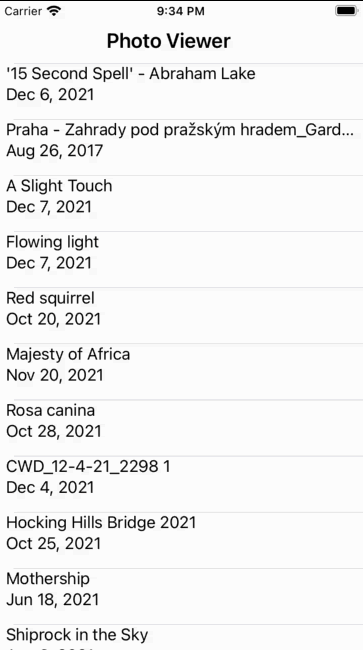
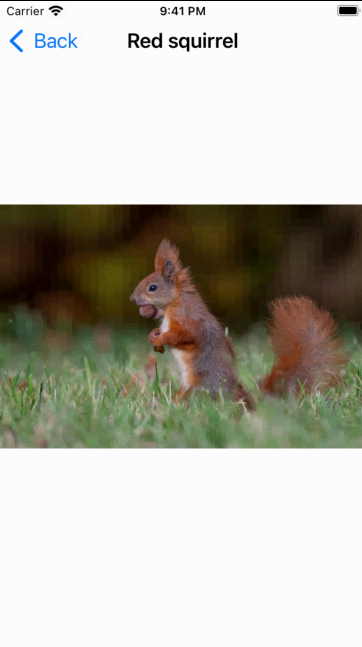

# Photorama

BNR Chapter 20-24. Implementing web service requests 

Project for CS275 at UVM. Based on the example from the Big Nerd Ranch Guide chapter 20-24. 

Purpose: Web Queries for images. Table view for photo info and detail view to see photo

When the app loads, it will be blank. There is a "Load Photos" Button in the upper right that will appear once the web query finishes. Click that to call the web query and load the photos. The service is using the Flickr API as described in the textbook. Once the web querey succedes, the table view will be filled with cells of image titles and dates as shown below. 

Click on one of the cells to view the photo itself. The following image shows an example of the detail view controller. 

